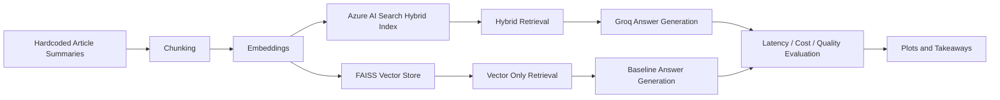

# Day 12 - Colab 2: Hybrid RAG + Long-Context with Groq

## Goal
Build the full RAG pipeline with LangChain, Azure AI Search, and Groq, then compare it against a full-context baseline.

## Architecture Diagram

## What You Will Learn
· How to build a hybrid search index with both keyword and vector retrieval
· How to instrument a pipeline into embed, retrieve, and generate stages
· How to compare vector-only retrieval against hybrid retrieval
· How to measure latency, token usage, and cost per query
· How to test full-context prompting against RAG at the same time

## Workflow
1. Install dependencies and import the required libraries.
2. Set the OpenAI, Groq, and Azure AI Search credentials.
3. Load the 20 hardcoded article summaries.
4. Split the content into chunks and generate embeddings once.
5. Create and populate the Azure AI Search hybrid index.
6. Build the FAISS vector store from the same embeddings.
7. Run the instrumented RAG pipeline with embed, retrieve, and generate timing.
8. Evaluate hybrid retrieval quality with MRR@5.
9. Run the full-context baseline with the first 50 chunks.
10. Compare both approaches on 20 test questions.
11. Plot latency, cost, and token usage.
12. Try the optional extensions for streaming and confidence filtering.

## Architecture View
The notebook creates one shared embedding layer, then uses those embeddings in two retrieval paths: Azure AI Search for hybrid retrieval and FAISS for vector-only retrieval. Both paths feed the same Groq generation layer so the comparison stays fair.

## Code Steps
### Step 0a - Install Dependencies
Install the pinned LangChain, Groq, Azure Search, and plotting packages.

Why this step matters:
It makes sure the notebook uses the same package versions every time so the code behaves consistently.

### Step 0b - API Keys and Config
Set `OPENAI_API_KEY`, `GROQ_API_KEY`, `AZURE_SEARCH_ENDPOINT`, `AZURE_SEARCH_API_KEY`, and the shared model settings.

Why this step matters:
The notebook cannot create embeddings, call Groq, or create the Azure index without credentials.

### Corpus Setup
Load the 20 article summaries, chunk them, and create embeddings.

What the code is doing:
The notebook loads the article JSON, converts it into LangChain documents, and then splits the text into chunks that are small enough for retrieval.

### Step 01 - Build RAG Pipeline
Create the Azure AI Search hybrid index, upload the chunk vectors, and define the retrieval plus Groq answer flow.

What the code is doing:
The notebook defines the search schema, enables hybrid retrieval, uploads the documents, and wraps the retrieval plus generation logic into a single answer function.

### Step 02 - Hybrid Retrieval Quality
Compare vector-only FAISS retrieval with Azure hybrid retrieval using MRR@5.

What the code is doing:
The notebook checks whether the relevant article appears near the top of the results and computes the average reciprocal rank.

### Step 03 - Full Context Baseline
Stuff the first 50 chunks into the model context and measure latency and cost.

What the code is doing:
The notebook builds one large prompt, sends it to the model, and records how expensive and slow the full-context method is compared to RAG.

### Step 04 - A/B Evaluation
Run both pipelines across 20 test questions and compare the averages.

What the code is doing:
The notebook runs the same questions through both approaches so you can compare response time, token usage, and query cost side by side.

### Step 05 - Latency Profiler
Break down RAG latency into embedding, retrieval, and generation stages.

What the code is doing:
The notebook measures each stage separately so you can see where most of the time is spent.

### Extensions
Use streaming responses for time-to-first-token testing and a confidence filter to block weak answers.

What the code is doing:
The notebook adds production-style features that make the assistant feel faster and safer.

## How to Run
1. Open `Colab2_Hybrid_RAG_LongContext_Claude_v2.ipynb`.
2. Run the dependency installation cell first.
3. Fill in all API keys and Azure Search settings.
4. Execute the notebook from top to bottom without skipping setup cells.
5. Wait for the Azure index creation and document upload steps to finish.
6. Run the smoke tests for the RAG and full-context pipelines.
7. Continue with the MRR, A/B evaluation, and latency charts.
8. Use the optional extension cells only after the main workflow works.
9. Delete the Azure index at the end if you do not want to keep the resource.

## Cell Order
1. Setup and imports
2. API key and config cell
3. Corpus loading and chunking
4. Embedding generation
5. Azure AI Search index creation
6. Document upload
7. Hybrid retrieval helper
8. FAISS store and Groq client setup
9. RAG result dataclass and smoke test
10. Hybrid retrieval evaluation
11. Full-context baseline
12. A/B comparison and plots
13. Latency profiler
14. Streaming extension
15. Confidence filter extension

## Notes
· The notebook uses the same 20 hardcoded article summaries for both FAISS and Azure AI Search.
· The A/B evaluation makes multiple Groq calls, so keep the API keys active.
· The Azure free tier is enough for this lab if you only need one index.
· If you are learning the notebook, run one section at a time and inspect the outputs before moving on.