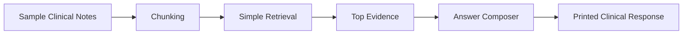

# Day 12 Self Project - Clinical RAG Assistant

## Goal
Build a small clinical RAG project that can answer questions from a sample knowledge base and explain how the pipeline works step by step.

## Architecture Diagram

## Code-Wise Flow
1. Load the sample clinical notes from `data/sample_clinical_notes.txt`.
2. Split the text into chunks so each chunk can be searched independently.
3. Build a lightweight bag-of-words retrieval index.
4. Ask a user question and score each chunk against the query.
5. Select the most relevant chunks.
6. Compose an answer from the retrieved evidence.
7. Print the answer and the supporting sources.

## Files
1. `src/app.py` - command-line entry point for the project.
2. `src/retrieval.py` - chunking and scoring logic.
3. `src/prompts.py` - answer formatting helpers.
4. `data/sample_clinical_notes.txt` - small example clinical knowledge base.

## How To Run
1. Open a terminal in `day12/clinical_rag_self_project`.
2. Run `python src/app.py`.
3. Read the printed answer and the matched evidence chunks.
4. Change the question in `src/app.py` or pass your own question in the code.

## What the Project Demonstrates
1. Document ingestion and chunking.
2. Simple retrieval from a knowledge base.
3. Answer generation using retrieved evidence.
4. A basic pattern that can later be swapped for embeddings, FAISS, Azure AI Search, and Claude.

## Homework Submission Checklist
1. Explain the workflow in your own words.
2. Show how the question is matched to the knowledge base.
3. Describe why the retrieved chunks were selected.
4. Mention one limitation of the simple local prototype.
5. Explain how you would upgrade it to a production RAG system.

## Notes
This project is intentionally simple so the code path is easy to understand before moving to a full hybrid RAG setup.