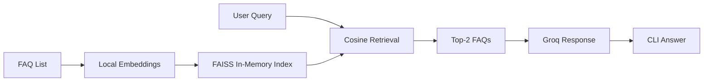

# Smart FAQ Bot

## Goal
Build a minimal RAG-powered FAQ bot in under 20 minutes.

## Architecture Diagram

## Code-Wise Flow
1. Start with a Python list of 10 FAQ strings.
2. Embed all FAQs with a local in-memory embedding layer.
3. Store the vectors in an in-memory FAISS index.
4. Accept a user query from the CLI.
5. Retrieve the top-2 most similar FAQs.
6. Send the retrieved FAQs plus the query to Groq.
7. Print a concise grounded answer and the source FAQs.
8. Type `exit` to quit the loop.

## Constraints
1. Keep the code under 60 lines.
2. Use only LangChain for the AI stack.
3. Work offline for retrieval using FAISS.
4. Show similarity scores as a bonus if you want.

## How To Run
1. Install the dependencies from `requirements.txt`.
2. Run `python app.py`.
3. Ask questions about the sample product FAQs.
4. Type `exit` to stop.

## Keys
The starter script will try Groq for generation, and if the API call fails it falls back to a local grounded answer so the bot still runs in class.

## Homework Prompt
Build your own 10-FAQ assistant for a product or domain of your choice. Keep the code compact, explain the retrieval flow, and show one example answer.
